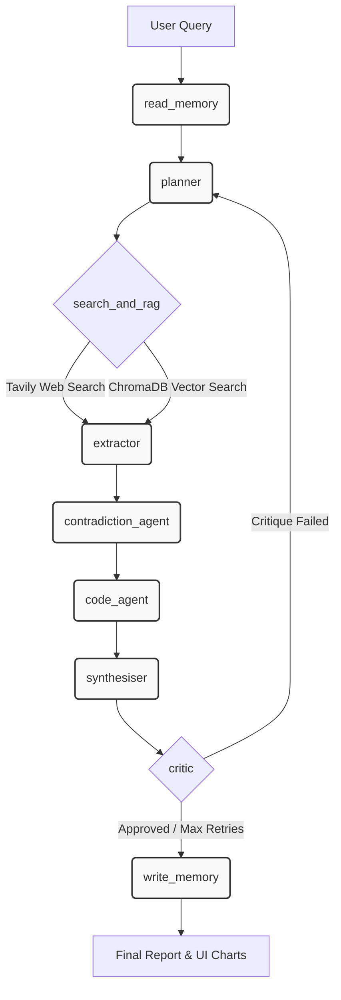

# NEXUS Intelligence OS

NEXUS Intelligence OS is an autonomous, multi-agent research pipeline that orchestrates a team of specialized AI agents to conduct deep research, extract factual insights, detect logical contradictions, generate data visualizations, and synthesize comprehensive reports.

Built with LangGraph and powered by Groq, NEXUS ensures high-quality, hallucination-free research through strict schema validation, automated code execution, and a reflection loop that forces the system to revise its work until it meets a high quality threshold.

---

## Architecture & Pipeline

NEXUS operates as a directed acyclic graph (DAG) where each node is a specialized agent. The pipeline flows as follows:

1. Read Memory (read_memory): Queries long-term ChromaDB storage for related past research and logs the new session to SQLite.
2. Planner (planner): Deconstructs the user's main query into targeted sub-questions.
3. Search & RAG (search_and_rag): Runs in parallel to fetch live web data (via Tavily) and retrieve relevant internal knowledge.
4. Extractor (extractor): Analyzes raw content and extracts structured insights, enforcing strict confidence thresholds and accurate URL source attribution.
5. Contradiction Detector (contradiction_agent): Cross-references all extracted insights against each other to find conflicting claims, assigning severity scores to logical contradictions.
6. Code Agent (code_agent): Detects if the research requires numerical or statistical analysis. If so, it writes and executes Python code in a secure headless environment to generate quantitative matplotlib charts.
7. Synthesiser (synthesiser): Weaves the validated insights and chart data into a highly structured, readable markdown report.
8. Critic (critic): Evaluates the final report on evidence, coherence, and coverage. If the report fails, the pipeline loops back to the planner for a rewrite (up to 3 retries).
9. Write Memory (write_memory): Saves the newly validated insights back to ChromaDB for future queries.

---

## Key Features

* Multi-Agent Orchestration: Specialized agents handle distinct phases of research, from planning to critique.
* Live Streaming UI: A Streamlit frontend consumes Server-Sent Events (SSE) from a FastAPI backend, displaying real-time progress across the agent rail.
* Automated Data Visualization: Capable of writing Python code on the fly to generate, save, and embed statistical charts directly into the final report.
* Contradiction Mapping: Automatically detects conflicting research claims and renders a visual Network Graph highlighting the severity of disagreements.
* Self-Healing Reflection: The Critic agent prevents low-quality outputs by forcing the pipeline to rewrite and re-research if evidence or coherence thresholds aren't met.
* Long-Term Memory: Integrates ChromaDB for semantic knowledge retention and SQLite for session tracking.

---

## Tech Stack

* Orchestration: LangGraph
* Inference: Groq API (Lightning fast OSS models)
* Validation: Pydantic
* Web Search: Tavily
* Vector DB: ChromaDB
* Backend: FastAPI + SSE
* Frontend: Streamlit
* Visualization: Matplotlib, NetworkX

---

## Setup & Installation

1. Clone the repository and enter the directory:
   git clone <repo-url>
   cd NEXUS

2. Set up a virtual environment:
   python -m venv .venv
   source .venv/bin/activate  # On Windows use: .venv\Scripts\activate

3. Install dependencies:
   pip install fastapi uvicorn streamlit pydantic langgraph groq tavily-python chromadb networkx matplotlib python-dotenv

4. Configure Environment Variables:
   Create a .env file in the root directory and add your API keys:
   GROQ_API_KEY=your_groq_api_key
   TAVILY_API_KEY=your_tavily_api_key

---

## Usage

NEXUS requires both the FastAPI backend and the Streamlit frontend to run simultaneously.

1. Start the API Server:
python api/server.py

2. Start the UI:
Open a new terminal window and run:
streamlit run ui/app.py

Navigate to http://localhost:8501 in your browser. Enter a complex research query (e.g., "What are the effects of caffeine on sleep quality, and how does consumption vary across age groups?") and watch the agents go to work!
